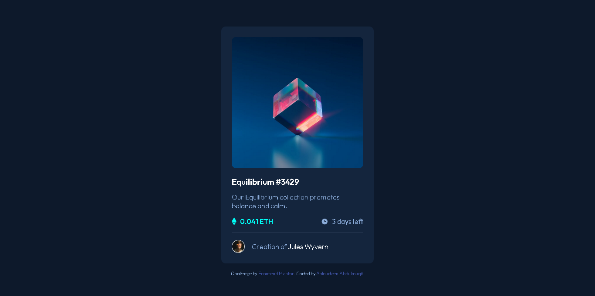

# Frontend development-NFT Preview Card Component solution

This is a solution to the [NFT preview card component challenge on Frontend Mentor](https://www.frontendmentor.io/challenges/nft-preview-card-component-SbdUL_w0U). Frontend Mentor challenges help you improve your coding skills by building realistic projects.

## Overview
This document serves as a comprehensive overview of my HTML/CSS project, which focuses on creating an interactive NFT preview card component. The component is designed to showcase the essential features of digital artworks in the non-fungible token (NFT) marketplace, providing users with a visually appealing and informative stub for potential buyers.

### The Challenge
The primary challenge was to create a visually engaging component that adheres to modern web design principles while effectively conveying crucial information about each NFT item, including the image, title, creator, price, and additional details.

### Screenshot

### Links
- [Live Demo](http://yourliveurl.com)
- [GitHub Repository](http://github.com/yourrepository)

## My Process
### Built With
- HTML
- CSS

### What I Learned
Through the development of the NFT preview card component, I enhanced my skills in HTML and CSS, specifically in utilizing Flexbox for responsive layouts. I also gained insights into best practices for creating visually appealing UI components.I also learnt how to incooperate JS to enhance interactivity, enabling the hover effect.### Continued Development
Moving forward, I plan to extend this project by incorporating JavaScript to enhance interactivity, enabling features such as hover effects and dynamic content loading.

### Useful Resources
[Github](https://github.com/samuelpletain/FEM-NFT-preview-card-component-challenge.git)

## Author
This project was developed by [SalaudeenAbdulmuqit].

## Acknowledgments
I would like to express my gratitude to my Lecturer[Mr.Kingson] and the online web development community, particularly those who provided tutorials and resources that facilitated my learning throughout this project. Your contributions greatly enriched my understanding of web design.